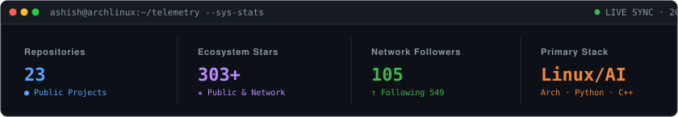

<div align="center">

# Ashish Singh Bora

**Computer Science Engineer · Linux & Systems · AI/ML · Open Source**

[](https://github.com/ashishsinghbora)
[](https://www.linkedin.com/in/ashishsinghbora/)
[](https://ashishsinghbora.github.io/Portfolio/)
[](mailto:mr.ashishsinghbora@gmail.com)

<br/>

<a href="https://github.com/ashishsinghbora">
  
</a>

</div>

---

### $ whoami

```text
Host        : ashish@archlinux
Kernel      : Linux x86_64
Role        : Computer Science Engineer
Focus       : Linux Systems, Autonomous AI Architectures, Systems Automation & Open Source
Methodology : Understand internals → Build reliably → Benchmark → Automate
Status      : Active contributor & systems builder
```

Computer Science engineer specializing in **Linux systems, autonomous AI agents, and systems automation**. I focus on software from the foundation up: understanding kernel interfaces, POSIX standards, memory constraints, and neural compute runtimes, then building robust tools, reproducible experiments, and automated infrastructure.

---

### ⚡ Current Focus

<table>
<tr>
<td width="50%" valign="top">

#### 🐧 Systems & Infrastructure
* **Operating Systems:** Linux internals, Arch Linux daily driver, POSIX standards
* **Tooling & Automation:** Modular Bash engineering, system utilities, Python, C++
* **Infrastructure:** Systemd service hardening, containerization, reproducible builds
* **Design Goals:** Minimal bloat, high execution speed, zero unnecessary dependencies

</td>
<td width="50%" valign="top">

#### 🤖 AI & Autonomous Systems
* **Reinforcement Learning:** Gymnasium benchmarking, policy optimization, adaptive control
* **Autonomous Agents:** On-device agentic architectures under strict resource constraints (<50MB RAM)
* **Computer Vision:** Planetary surface image registration, feature matching under severe illumination shifts
* **Deep Learning:** PyTorch, ONNX, edge inference, reproducible training pipelines

</td>
</tr>
<tr>
<td width="50%" valign="top">

#### 🌐 Open Source & Reliability
* **Code Quality:** Comprehensive test suites, behavioral validation, static analysis
* **CI/CD Automation:** Declarative GitHub Actions workflows, automated releases
* **Upstream Contributions:** Issue triage, code reviews, PR testing, reproducible reproductions
* **Toolchains:** Strict linting, formatting, deterministic environment configurations

</td>
<td width="50%" valign="top">

#### 🔬 Active Engineering
* **[AdaptiveRL (ARL)](https://github.com/StellarResearch/ARL):** Modular reinforcement learning platform
* **[LinuxScripts](https://github.com/ashishsinghbora/LinuxScripts):** 53-point validated Linux administration toolkit
* **[ResilienceOS](https://github.com/ashishsinghbora/ResilienceOS):** Resilient, offline-first Arch Linux ISO architecture
* **[ETS](https://github.com/ashishsinghbora/ETS):** Client-side encrypted tiered cloud storage for SBCs

</td>
</tr>
</table>

---

### 🚀 Featured Projects

| Project | Domain | Description | Stack |
| :--- | :--- | :--- | :--- |
| **[AdaptiveRL](https://github.com/StellarResearch/ARL)** | Reinforcement Learning | Modular multi-environment reinforcement learning framework benchmarked across Farama Gymnasium environments up to autonomous 3D drone navigation. | `Python` `PyTorch` `Gymnasium` `SB3` |
| **[LinuxScripts](https://github.com/ashishsinghbora/LinuxScripts)** | Linux Administration | Practical, modular Bash utilities for system administration, diagnostics, hardware telemetry, storage, and automated maintenance with zero bloat. | `Bash` `POSIX` `Shell` `CI/CD` |
| **[ResilienceOS](https://github.com/ashishsinghbora/ResilienceOS)** | Edge OS Architecture | Custom Arch Linux environment and ISO build pipeline designed for resilient, offline-capable, and edge computing workloads. | `Arch Linux` `Shell` `Systemd` |
| **[ETS](https://github.com/ashishsinghbora/ETS)** | Storage & Encryption | Client-side encrypted tiered cloud storage pipeline optimized for low-power Linux single-board computers (Raspberry Pi, Rockchip) and home servers. | `Shell` `Linux` `Cryptography` |
| **[Samanvaya](https://github.com/ashishsinghbora/Samanvaya)** | Computer Vision | Planetary image registration engine for lunar optical and NIR datasets under extreme shadow reversals. | `Python` `OpenCV` `NumPy` |
| **[Void](https://github.com/ashishsinghbora/Void)** | On-Device AI | Ultra-lightweight local agentic platform designed for Android/Termux environments operating under strict memory constraints (<50MB RAM). | `Python` `Local LLMs` `Linux/Android` |

---

### 🧰 Technical Stack

```text
┌──────────────────┬─────────────────────────────────────────────────────────────┐
│ Layer            │ Technologies                                                │
├──────────────────┼─────────────────────────────────────────────────────────────┤
│ Core & Systems   │ Linux (Arch), Bash / POSIX Shell, C++, Python, Git          │
│ AI / ML Runtimes │ PyTorch, Farama Gymnasium, Stable-Baselines3, OpenCV, NumPy │
│ Infrastructure   │ Docker, GitHub Actions, Systemd, Linux userland utilities   │
│ Web & Interfaces │ TypeScript, Next.js, Tailwind CSS                           │
└──────────────────┴─────────────────────────────────────────────────────────────┘
```

---

### 📡 Live Profile Telemetry

<!-- PROFILE:START -->
| Metric | Specification | Status |
| :--- | :--- | :---: |
| **Public Repositories** | Active open source repositories | `24` |
| **Total Stars Earned** | Public repositories & ecosystem contributions | `★ 327` |
| **Followers** | Technical peers & collaborators | `107` |
| **Following** | Engineers, researchers & projects followed | `405` |
| **Public Gists** | Standalone scripts, configs & benchmarks | `2` |
| **Telemetry Status** | Last automated verification timestamp | `2026-09-26 (UTC)` |
<!-- PROFILE:END -->

---

### 📈 Recent Public Activity

<!-- AUTO:START -->
| Repository | Description | Language | Stars | Last Pushed |
| :--- | :--- | :---: | :---: | :---: |
| **[LinuxScripts](https://github.com/ashishsinghbora/LinuxScripts)** | A collection of practical, safe, and modular Bash utilities for Linux system administration,... | `Shell` | ★ 13 | `2026-09-26` |
| **[Flashcore](https://github.com/ashishsinghbora/Flashcore)** | FlashCore — Open-source, non-root Android utility to create bootable USB drives (Linux Hybri... | `Kotlin` | ★ 17 | `2026-09-26` |
| **[Samanvaya](https://github.com/ashishsinghbora/Samanvaya)** | Planetary image registration engine for lunar optical and NIR datasets under extreme shadow... | `Python` | ★ 16 | `2026-09-26` |
| **[Void](https://github.com/ashishsinghbora/Void)** | VOID (Versatile On-device Intelligent Daemon)is an enterprise-grade, ultra-lightweight local... | `Python` | ★ 15 | `2026-09-26` |
| **[Magicloder](https://github.com/ashishsinghbora/Magicloder)** | Python script to download YouTube videos in highest resolution. | `Go` | ★ 16 | `2026-09-26` |
| **[ResilienceOS](https://github.com/ashishsinghbora/ResilienceOS)** | — | `—` | ★ 14 | `2026-09-26` |

> ⚡ *Automated live sync executed on `2026-09-26` via GitHub Actions.*
<!-- AUTO:END -->

---

### 🧠 Engineering Principles

* **First-Principles Grounding:** Understand lower-level fundamentals before layering abstractions.
* **Deterministic & Reproducible:** Enforce strict configurations, seeds, and automated validation.
* **Minimal Dependencies:** Prioritize the standard library and native OS capabilities over heavy frameworks.
* **Automate Everything:** If a process runs more than twice, encode it into a resilient script or CI workflow.

---

<div align="center">
  <sub>Maintained automatically via GitHub Actions with pure Python standard library telemetry.</sub>
</div>
